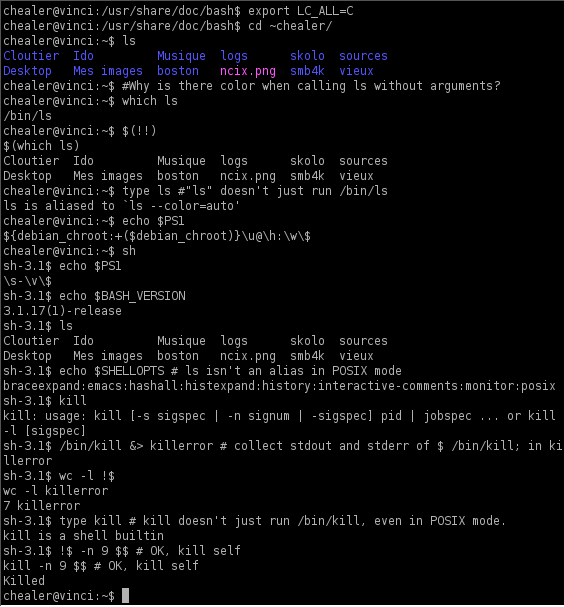

# 운영체제의 종류

## Windows

- Windows는 **1990년대 마이크로소프트(Microsoft) 사가 개발한 운영체제**이다.
- **Windows의 주요 특징**
  - GUI
    - 키보드로 명령어를 직접 입력하지 않고, 마우스로 아이콘이나 메뉴를 선택하여 모든 작업을 수행하는 방식
  - 선점형 멀티태스킹(Preemptive Multi-Tasking)
    - 동시에 여러 개의 프로그램을 실행하는 멀티태스킹을 하면서 운영체제가 각 작업의 CPU 이용 시간을 제어
  - PnP(Plug and Play)
    - 컴퓨터 시스템에 프린터나 사운드 카드 등의 하드웨어를 설치했을 때 필요한 시스템 환경을 운영체제가 자동으로 구성
  - OLE(Object Linking and Embedding)
    - 다른 여러 응용 프로그램에서 작성된 문자나 그림 등의 개체(Object)를 현재 작성 중인 문서에 자유롭게 연결(Linking)하거나 삽입(Embedding)하여 편집할 수 있게 하는 기능
  - 255자의 긴 파일명
  - Single-User System

## UNIX

- UNIX는 1960년대 **AT&T 벨(Bell) 연구소, MIT, General Electric이 공동 개발한 운영체제**이다.
- 시분할 시스템(Time Sharing System)을 위해 설계된 대화식 운영체제이다.
- 소스가 공개된 개방형 시스템(Open System)이다.
- 대부분 C 언어로 작성되어 있어 이식성이 높으며 장치, 프로세스 간의 호환성이 높다.
- Multi-User, Multi-Tasking
- Tree 구조의 파일 시스템

### UNIX 시스템의 구성

- 커널(Kernel)
  - 하드웨어를 보호하고, 프로그램과 하드웨어 간의 인터페이스 역할을 담당
  - 프로세스(CPU 스케줄링) 관리, 기억장치 관리, 파일 관리, 입∙출력 관리, 프로세스간 통신, 데이터 전송 및 변환 등 여러 가지 기능을 수행
- 쉘(Shell)
  - 사용자의 명령어를 인식하여 프로그램을 호출하고 명령을 수행하는 명령어 해석기
  - 시스템과 사용자간의 인터페이스를 담당
  - **Bourne Shell, C Shell, Korn Shell, Z Shell(zsh)**

## LINUX

- LINUX는 1991년 **리누스 토발즈(Linus Torvalds)가 UNIX를 기반으로 개발한 운영체제**이다.
- 오픈 소스이기 때문에 프로그래머가 원하는 기능을 추가할 수 있다.
- 다양한 플랫폼에 설치하여 사용이 가능하며, 재배포가 가능하다.
- UNIX와 완벽하게 호환

## MacOS

- MacOS는 1980년대 **Apple 사가 UNIX를 기반으로 개발한 운영체제**이다.

## Android

- Android는 **Google 사에서 개발한 리눅스 커널 기반의 개방형 모바일 운영체제**이다.
- 모든 코드가 공개된 개방형 소프트웨어이다.
- 스마트폰 등의 휴대용 장치에서 주로 사용된다.

## iOS

- iOS는 **Apple 사에서 개발한 유닉스 기반의 모바일 운영체제**이다.
